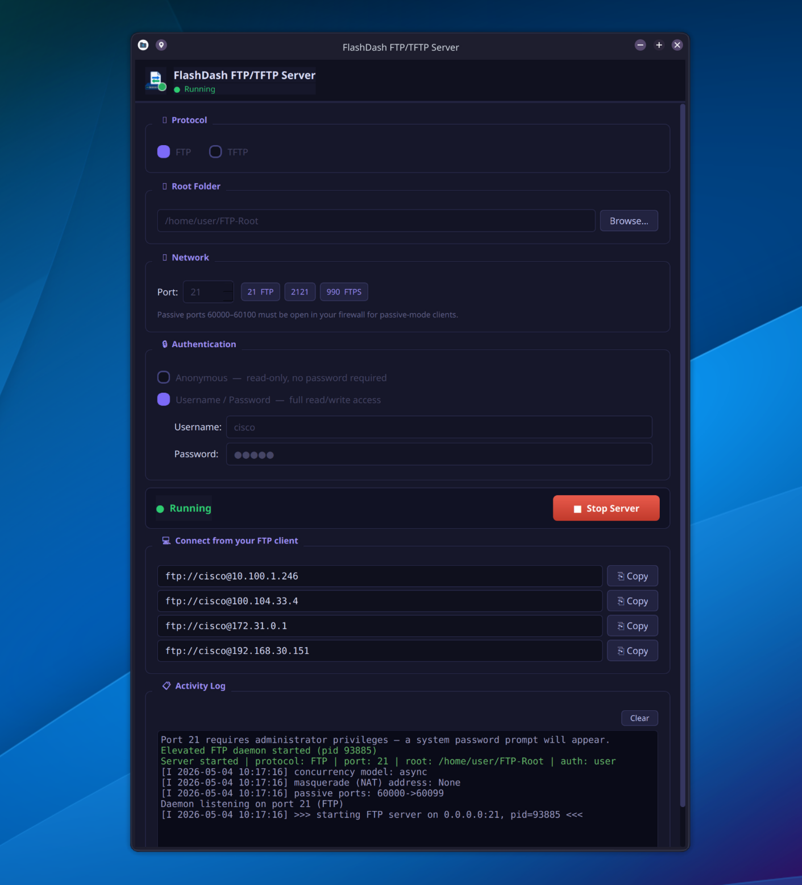

# FlashDash FTP/TFTP Server

> A simple, no-nonsense FTP and TFTP server with a polished GUI — built for network engineers who need to transfer files **fast**, without setup overhead.



---

## What is FlashDash?

FlashDash is a lightweight desktop application that spins up an FTP or TFTP server in seconds. It is designed for **network engineers**, **sysadmins**, and **homelab enthusiasts** who regularly push firmware, configs, and OS images to routers, switches, and other network devices.

Pick a folder, pick a protocol, click **Start** — you're done.

---

## Features

- **FTP & TFTP** — switch between protocols with a single click
- **Anonymous or authenticated** FTP (username/password with full read/write access)
- **Multi-IP URL display** — one copy button per interface address
- **System tray** — minimize to tray, right-click to start/stop
- **Privilege escalation** — uses `pkexec` to bind ports < 1024 without running the whole app as root
- **Color-coded activity log** — connects, transfers, errors at a glance
- **Dark UI** — easy on the eyes during long lab sessions

---

## When *not* to use FlashDash

FlashDash is intentionally minimal. It has **no TLS/FTPS encryption**, no user management, and no access controls beyond a single username/password pair.

If you need a production-grade server with encryption, certificate management, advanced permissions, or high-throughput logging, use **[FileZilla Server](https://filezilla-project.org/)** instead.

---

## Installation

### Quick install (Linux)

```bash
git clone https://github.com/YOUR_USERNAME/flashdash.git
cd flashdash
bash install.sh
```

This creates a Python virtualenv, installs dependencies, writes a `flashdash` launcher script, and registers a `.desktop` entry so the app appears in your application menu.

### Requirements

- Python 3.9+
- PyQt5 ≥ 5.15 (including `PyQt5.QtSvg`)
- pyftpdlib ≥ 1.5.7
- tftpy ≥ 0.8.0
- `pkexec` (optional — needed to bind ports < 1024 as a normal user)

Install Python dependencies manually:

```bash
pip install -r requirements.txt
```

### Run directly

```bash
python ftp_server_app.py
```

---

## Usage

1. **Select protocol** — FTP (TCP) or TFTP (UDP)
2. **Choose a root folder** — the directory that will be shared
3. **Set the port** — defaults are 21 (FTP) and 69 (TFTP); ports ≥ 1024 work without root
4. **Configure auth** — anonymous (read-only) or username/password (read/write) *(FTP only)*
5. Click **▶ Start Server**
6. Copy the connection URL shown for your interface and paste it into your FTP/TFTP client or device

---

## Packaging

Pre-built `.deb` (Debian/Ubuntu) and `.rpm` (Fedora/RHEL) packages are built automatically by GitHub Actions on every tagged release.

Download them from the [Releases](../../releases) page.

---

## License

MIT — see [LICENSE](LICENSE).
